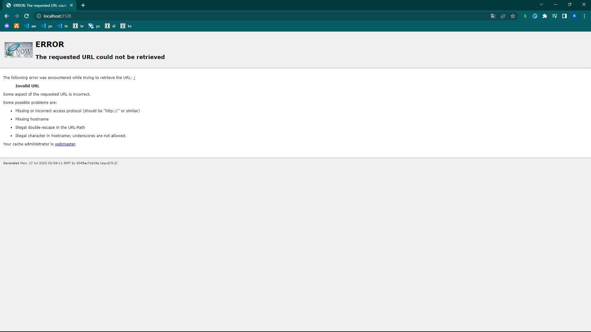

# squid

proxy server docker files


# how to run

move to `docker-compose.yml`directory. and run

```sh
docker-compose up -d
```

then start server.


## confilm logs

```sh
docker logs -f mysquid
```


## confilm action: access below url

access below url.

http://localhost:3128/





